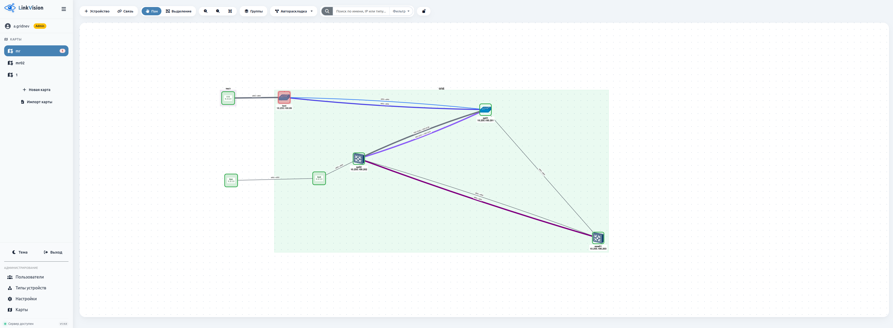

# LinkVision


LinkVision — это веб-приложение для визуализации и мониторинга сетевой инфраструктуры. Оно позволяет создавать интерактивные карты сети, добавлять устройства, устанавливать связи между ними и отслеживать их доступность в реальном времени.

 

## Возможности

- 🗺️ **Создание карт сети** – несколько независимых карт с возможностью загрузки фонового изображения.
- 💻 **Управление устройствами** – добавление, редактирование и удаление устройств (коммутаторы, маршрутизаторы, серверы, ПК) с указанием IP-адресов и настраиваемыми иконками.
- 🔗 **Настройка связей** – создание логических соединений между устройствами, выбор цвета, толщины и стиля линии (сплошная, пунктирная, точечная). Предустановки для различных скоростей (100M, 1G, 10G, 25G, 100G, 400G) и типов (VLAN, Radio).
- 📡 **Мониторинг доступности** – регулярная проверка устройств с помощью ICMP-ping. Поддержка как чистого Python-модуля `ping3`, так и встроенного системного `ping`.
- 🔔 **Обновление статуса в реальном времени** – через WebSocket статус устройств (UP/DOWN) мгновенно отображается на карте: зелёная рамка для доступных, красная пунктирная для недоступных, с плавной пульсацией для привлечения внимания.
- 📊 **Счётчик проблем** – для каждой карты в сайдбаре отображается количество недоступных устройств.
- 👥 **Многоуровневое управление пользователями** – администраторы могут создавать, редактировать и удалять пользователей, назначать права. Обычные пользователи видят только свои карты.
- 🎨 **Тёмная и светлая темы** – переключение одним кликом, настройка сохраняется в браузере.
- 📱 **Адаптивный дизайн** – сайдбар сворачивается, интерфейс комфортно работает на разных устройствах.

## Требования

- **Python** 3.10 или выше
- **pip** (менеджер пакетов Python)
- **Git** (для клонирования репозитория)

## Автоматическая установка на Ubuntu (скрипт)
### 1. Клонируйте репозиторий:
Для быстрой и удобной установки LinkVision на Ubuntu (или других Debian-подобных системах) подготовлен скрипт автоматической установки.
```
git clone https://github.com/Sivolen/LinkVision.git /opt/linkvision
cd /opt/linkvision
```
### 2. Сделайте скрипт исполняемым:
```
chmod +x install.sh
```
### 3. Запустите скрипт (рекомендуется с правами root для автоматической установки systemd-сервиса):
```
sudo ./install.sh
```
## Установка и запуск

### 1. Клонирование репозитория

```bash
# Скопируйте или склонируйте проект
sudo git clone https://github.com/Sivolen/LinkVision.git /opt/linkvision
cd /opt/linkvision
# Настройте права (опционально, но рекомендуется)
sudo chown -R root:root /opt/linkvision
sudo chmod -R 755 /opt/linkvision
```
### 2. Создание виртуального окружения (рекомендуется)
```
python -m venv venv
source venv/bin/activate      # для Linux/macOS
```
#### Установка зависимостей:
```
pip install -r requirements.txt
```
### 4. Настройка конфигурации
При необходимости отредактируйте файл config.py:

    SECRET_KEY – Генерируется при первом запуске.

    SQLALCHEMY_DATABASE_URI – при желании можно переключиться на другую БД (например, PostgreSQL).

    UPLOAD_FOLDER – путь для загрузки иконок и фонов карт.

    VERSION – версия приложения (отображается в сайдбаре).
### 5. Инициализация базы данных
При первом запуске база данных (webnetmap.db) создастся автоматически. Для применения миграций (если используется Flask-Migrate) выполните:
```
flask db upgrade
```
### 6. Запуск приложения
```
python app.py
```
### 7. Первый вход
После запуска перейдите по адресу http://127.0.0.1:5000. В системе уже создан администратор:

- Логин: admin
- Пароль: admin

Рекомендуется сменить пароль после первого входа!

### 7. Запуск как systemd-сервис (Ubuntu/Debian)
⚠️ Внимание: часть задач в LinkVision требует прав суперпользователя (например, отправка raw ICMP-пакетов, работа с сетевыми интерфейсами). Поэтому сервис настроен на запуск от имени root.
Рекомендация: используйте этот режим только в доверенной изолированной среде. Для публичных серверов рассмотрите запуск от обычного пользователя с выдачей минимальных привилегий через setcap или sudoers.

#### Скопировать из проекта в систему
```
sudo ln -s /opt/LinkVision/linkvision.service /etc/systemd/system/linkvision.service
```
#### Активируйте и запустите сервис
```
# Перезагрузить конфигурацию systemd (обязательно после создания/изменения файла)
sudo systemctl daemon-reload

# Включить автозагрузку при старте системы
sudo systemctl enable linkvision.service

# Запустить сервис
sudo systemctl start linkvision.service

# Проверить статус
sudo systemctl status linkvision.service
```
✅ Если всё настроено верно, вы увидите:
```
● linkvision.service - LinkVision - Network Infrastructure Visualization
     Loaded: loaded (/etc/systemd/system/linkvision.service; enabled)
     Active: active (running) since ...
```
### Использование

- Создание карты – нажмите «Новая карта» в сайдбаре, укажите название (и при необходимости загрузите фон).
- Добавление устройств – на панели инструментов нажмите «Устройство», выберите тип, введите имя и IP.
- Создание связей – включите режим «Связь», последовательно выберите два устройства. В открывшемся окне настройте параметры линии.
- Мониторинг – статусы устройств обновляются автоматически. Недоступные узлы подсвечиваются красным и пульсируют.
- Администрирование – если вы администратор, в сайдбаре появится раздел «Администрирование», где можно управлять пользователями, типами устройств и настройками мониторинга.

#### Настройка мониторинга

В разделе администратора (/admin/settings) доступны параметры:

- Количество пакетов (ping count) – сколько ICMP-запросов отправлять при проверке (по умолчанию 4).
- Интервал опроса (секунды) – как часто выполнять проверку всех устройств (по умолчанию 10).

Изменения вступают в силу в следующем цикле мониторинга.

#### Структура проекта
    linkvision/
    ├── app.py                      # точка входа, создание приложения Flask
    ├── config.py                   # настройки (секретный ключ, БД, загрузки, версия)
    ├── extensions.py               # инициализация Flask-SQLAlchemy, LoginManager, SocketIO, Migrate
    ├── models.py                   # модели базы данных (User, Map, Device, Link, Group, Settings, UserMapSettings и др.)
    ├── requirements.txt            # зависимости проекта
    ├── README.md                   # документация
    ├── blueprints/                 # модули (разделы приложения)
    │   ├── auth.py                 # аутентификация (вход, регистрация, выход)
    │   ├── admin.py                # администрирование (пользователи, типы, настройки, карты)
    │   ├── main.py                 # основные страницы (дашборд, карта, создание карты)
    │   └── api.py                  # REST API для работы с элементами карты
    ├── services/                   # бизнес-логика, вынесенная из эндпоинтов
    │   ├── __init__.py
    │   ├── user_service.py         # операции с пользователями
    │   ├── device_service.py       # операции с устройствами
    │   ├── map_service.py          # операции с картами, группами, связями
    │   ├── device_type_service.py  # операции с типами устройств
    │   ├── settings_service.py     # операции с настройками
    │   └── monitor.py              # фоновый процесс мониторинга устройств (синхронный)
    ├── utils/                      # вспомогательные модули
    │   ├── __init__.py
    │   └── logger.py               # настройка логирования
    ├── static/                      # статические файлы
    │   ├── css/                     # стили
    │   │   ├── bootstrap.min.css
    │   │   ├── all.min.css (FontAwesome)
    │   │   └── style.css            # кастомные стили
    │   ├── js/                      # скрипты
    │   │   ├── bootstrap.bundle.min.js
    │   │   ├── socket.io.js
    │   │   ├── cytoscape.min.js
    │   │   └── map.js               # основной скрипт карты
    │   ├── images/                   # логотипы, фавиконки
    │   └── uploads/                  # загружаемые файлы
    │       ├── icons/                # иконки типов устройств
    │       └── maps/                 # фоновые изображения карт
    ├── templates/                    # HTML-шаблоны
    │   ├── base.html                 # общий каркас с сайдбаром
    │   ├── login.html                # страница входа
    │   ├── register.html             # страница регистрации
    │   ├── dashboard.html            # дашборд (список карт пользователя)
    │   ├── map_view.html             # страница карты
    │   ├── no_maps.html              # сообщение об отсутствии карт для оператора
    │   └── admin/                     # шаблоны админ-панели
    │       ├── users.html
    │       ├── types.html
    │       ├── maps.html
    │       ├── settings.html
    │       └── backups.html          # резервное копирование (если отдельно)
    └── logs/                          # папка для логов (создаётся автоматически)
        ├── app.log
        ├── auth.log
        ├── admin.log
        ├── api.log
        ├── main.log
        └── monitor.log
### Обновление проекта при работе через systemd
```
# 1. Остановите сервис
sudo systemctl stop linkvision.service

# 2. Обновите код
cd /opt/linkvision
sudo git pull

# 3. Обновите зависимости (если менялся requirements.txt)
sudo /opt/linkvision/venv/bin/pip install -r requirements.txt

# 4. Запустите сервис обратно
sudo systemctl start linkvision.service

# 5. Проверьте логи на ошибки
sudo journalctl -u linkvision.service -n 20
```
#### Используемые технологии

- **Backend**:
  * Flask – микрофреймворк
  * Flask-SQLAlchemy – ORM для работы с БД
  * Flask-Login – управление пользовательскими сессиями
  * Flask-SocketIO – WebSocket для real-time обновлений
  * Eventlet – асинхронный сервер для SocketIO
  * ping3 – отправка ICMP-пакетов из Python (опционально)
- **Frontend**:
  * Bootstrap 5 – адаптивный интерфейс
  * Font Awesome 6 – иконки
  * Cytoscape.js – визуализация графа сети
  * Socket.IO client – взаимодействие с сервером
  * JavaScript (ES6) – логика клиента
- **База данных:** SQLite (по умолчанию, может быть заменена на PostgreSQL, MySQL через настройки SQLAlchemy).
#### Лицензия
Проект распространяется под лицензией MIT. См. файл LICENSE для подробностей.

### LinkVision – создан для удобного и наглядного контроля сетевой инфраструктуры. Приятного использования