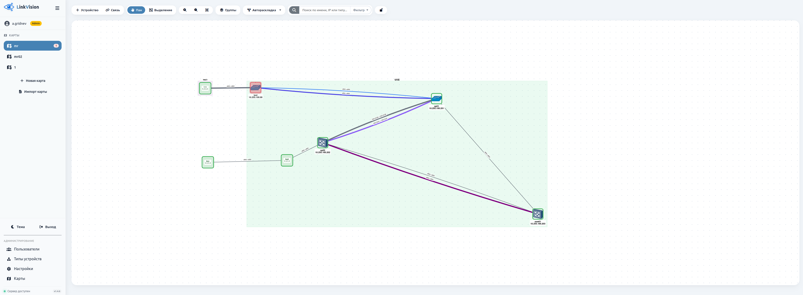

# LinkVision

**LinkVision 2.2.2** — веб-приложение для визуализации и мониторинга сетевой инфраструктуры.

LinkVision позволяет собрать сетевую инфраструктуру на интерактивной карте, организовать карты по папкам, объединять устройства во вложенные группы, настраивать связи и следить за доступностью узлов в реальном времени.



---

## Обзор

В основе приложения — интерактивная карта сети. Устройства, связи, группы и фигуры-зоны управляются через веб-интерфейс и хранятся в реляционной базе данных.

Подсистема мониторинга периодически проверяет устройства по ICMP и публикует изменения состояния подключённым клиентам через Socket.IO. Качество связи оценивается по потерям пакетов, задержке и джиттеру; история качества хранится в виде пятиминутных агрегатов.

По умолчанию используется SQLite. PostgreSQL подключается через `DATABASE_URL` — драйвер для выбранного SQLAlchemy URL нужно установить отдельно, в `requirements.txt` его нет.

---

## Возможности

### Интерактивные карты

- несколько независимых карт сети;
- фоновые изображения карт;
- drag & drop с сохранением положения объектов;
- устройства с несколькими IP-адресами, настраиваемыми иконками и типами;
- связи с настройкой цвета, толщины, стиля линии и размера подписи;
- предустановки скоростей (100M–400G) и типов связей (VLAN, Radio);
- автоматическое разведение близких и пересекающихся связей веером;
- фигуры (квадрат, прямоугольник, треугольник, круг, ромб) для выделения зон;
- поиск по объектам, мини-карта, полноэкранный режим;
- undo/redo для операций с картой;
- массовое редактирование устройств;
- блокировка карты от случайного редактирования.

### Папки и права доступа

Карты организуются в дерево папок и подпапок любой вложенности, с настройкой порядка.

Права выдаются **конкретному пользователю** или **роли** (`viewer`, `editor`, `admin`) — как на папку, так и на отдельную карту. Разрешение, выданное на папку, действует на её подпапки и находящиеся в них карты; если у пользователя несколько прав, применяется самое широкое.

Блокировка карты — отдельная операция с отдельным правом. Право разблокировать не зависит от текущего состояния замка, иначе заблокировавший карту пользователь не смог бы её разблокировать. Редактор не может редактировать заблокированную карту; роль `admin` сохраняет полный доступ.

Доступ проверяется на серверной стороне перед каждым защищённым действием, а не только скрытием элементов интерфейса.

### Группы устройств

- группы устройств;
- вложенные группы любой глубины;
- защита от циклических зависимостей;
- изменение родительской группы;
- сворачивание группы в компактный «пузырёк»;
- агрегированный статус свёрнутой группы (down > partial > up);
- переподключение связей к пузырьку при сворачивании;
- сохранение состояния свёрнутости в браузере.

### Мониторинг доступности

Подсистема мониторинга выполняет регулярные ICMP-проверки и предоставляет:

- настраиваемое количество ICMP-пакетов на проверку;
- настраиваемый интервал между циклами;
- настраиваемый таймаут отдельной операции;
- настраиваемый размер пула исполнителей и его изменение без перезапуска приложения;
- проверку через `ping3` с откатом на системную команду `ping`, если raw ICMP недоступен;
- обработку ошибок доступа к ICMP-сокету (`EPERM`, `EACCES`);
- сквозные номера пакетов для корректного расчёта RTT и джиттера;
- телеметрию длительности цикла и пика одновременных проверок;
- предупреждения, когда цикл приближается к заданному интервалу или превышает его;
- корректную остановку текущих проверок при перезапуске.

Размер пула задаётся в административном разделе, по умолчанию 150. Новое значение применяется на границе цикла мониторинга.

### Качество ICMP

Помимо статуса UP/DOWN собираются:

- потери пакетов;
- задержка (latency);
- джиттер.

Для живой классификации и для сохраняемых данных используется одна реализация `calculate_quality()`, поэтому отображаемое и хранимое качество не расходятся.

Профили качества настраиваются в административном разделе. Каждый профиль содержит пороги для состояний good, degraded и bad. Один профиль помечен как профиль по умолчанию; устройства без явно назначенного профиля используют его. Профиль можно назначить устройству независимо от общего профиля по умолчанию.

Дополнительно:

- прогрев нового окна наблюдения перед классификацией — кратковременные всплески потерь не меняют статус мгновенно;
- пятиминутные агрегаты качества;
- история качества;
- настраиваемый срок хранения истории;
- корректная обработка восстановления после недоступности устройства;
- отдельные показатели качества в карточке устройства.

### Обновления в реальном времени

Изменения состояния и качества доставляются клиентам через Socket.IO. Слой realtime обрабатывает:

- смену статуса устройства;
- изменение качества без смены UP/DOWN;
- восстановление после degraded/bad качества;
- синхронизацию после переподключения;
- смену видимости вкладки браузера;
- согласованность состояния карты и карточек устройств;
- устройства с выключенным мониторингом (явное `monitoring_enabled=false`).

Полный снимок состояния доступен через событие `request_status` и используется для восстановления состояния клиента после реконнекта.

### Импорт и экспорт

Карта выгружается в JSON и загружается обратно вместе с данными топологии: устройства, IP-адреса, связи, группы и иерархия групп, фигуры, параметры отображения и метаданные карты.

При импорте проверяются структура, ссылки между объектами и иерархия групп. Старые файлы без новых необязательных полей остаются совместимыми. Некорректные или циклические ссылки на родительскую группу отклоняются, а не приводят к тихому появлению несогласованной иерархии.

### Аудит и история

Ведутся записи аудита для административных операций и операций с картами, а также история изменений устройств и история доступности.

### Интерфейс

- русский и английский языки (Flask-Babel на бэкенде, словарь переводов для фронтенда);
- тёмная и светлая темы;
- адаптивный интерфейс, компактный тулбар на маленьких экранах;
- административный раздел: пользователи, типы устройств, карты, настройки мониторинга, профили качества, резервные копии.

---

## Безопасность

Реализованы:

- CSRF-защита всех изменяющих запросов API;
- экранирование пользовательских значений в HTML и inline-JS;
- проверка redirect-целей, в том числе защита от protocol-relative ссылок вида `//host`;
- logout только по POST, под CSRF-защитой;
- HttpOnly и SameSite для сессионных и remember-cookie;
- Secure-cookie для HTTPS-развёртываний;
- Content Security Policy, `Permissions-Policy`, `X-Frame-Options`, `X-Content-Type-Options`, `Referrer-Policy`;
- HSTS при включённом HTTPS;
- rate limiting для операций входа и регистрации;
- случайно генерируемый `SECRET_KEY` при первой установке;
- проверка сложности пароля и принудительная смена временного пароля администратора.

CSP включает `object-src 'none'`, `base-uri 'self'`, `form-action 'self'`.

Для production рекомендуется размещать приложение за HTTPS reverse proxy.

---

## Требования

### Для работы

- Python 3.10 или новее;
- pip, Git;
- доступ к ICMP для процесса мониторинга (raw ICMP требует root или `setcap`);
- Linux предполагает использование `install.sh` и systemd.

### Для сборки фронтенда

- Node.js;
- npm.

В репозитории лежат уже собранные бандлы, которые использует приложение. При изменении исходников в `static/js/` бандлы нужно пересобрать.

### База данных

SQLite — база по умолчанию. PostgreSQL подключается через `DATABASE_URL`; Python-драйвер PostgreSQL в базовые зависимости не входит и ставится отдельно под выбранный SQLAlchemy URL.

---

## Установка

### Автоматическая установка (Ubuntu/Debian)

```bash
git clone https://github.com/Sivolen/LinkVision.git /opt/LinkVision
cd /opt/LinkVision
chmod +x install.sh
sudo ./install.sh
```

Установщик:

1. проверяет полноту checkout;
2. проверяет версию Python;
3. ставит системные зависимости сборки;
4. создаёт или обновляет виртуальное окружение;
5. ставит Python-зависимости;
6. создаёт `.env` со случайным `SECRET_KEY`, если его ещё нет;
7. подготавливает SQLite-схему через `apply_migrations.sh`;
8. создаёт каталоги загрузок и логов;
9. по запросу устанавливает и запускает systemd-сервис.

Существующий `.env` не перезаписывается. Существующая PostgreSQL-схема остаётся нетронутой.

### Опции установщика

```text
-p URL
```

HTTP/HTTPS-прокси при установке Python-пакетов.

Поддерживаемые переменные окружения:

| Переменная | Назначение | По умолчанию |
|---|---|---|
| `LINKVISION_INSTALL_SERVICE` | Установить и запустить systemd-сервис | автоматически |
| `LINKVISION_PORT` | Порт приложения для systemd-развёртывания | `8005` |
| `LINKVISION_HTTPS` | Включить Secure для сессионных cookie | `false` |
| `LINKVISION_BEHIND_PROXY` | Доверять заголовкам reverse proxy | `false` |
| `LINKVISION_PYTHON` | Интерпретатор Python | `python3` |

Пример:

```bash
sudo LINKVISION_INSTALL_SERVICE=true \
     LINKVISION_PORT=8005 \
     LINKVISION_HTTPS=true \
     LINKVISION_BEHIND_PROXY=true \
     ./install.sh
```

### Ручная установка

Подходит для систем, отличных от Ubuntu/Debian, и для разработки.

```bash
git clone https://github.com/Sivolen/LinkVision.git /opt/LinkVision
cd /opt/LinkVision

python3 -m venv venv
source venv/bin/activate
pip install -r requirements.txt

npm install
npm run build

./apply_migrations.sh
```

---

## Конфигурация

Параметры времени выполнения хранятся в `.env`, шаблон — `.env.example`.

| Переменная | Назначение | По умолчанию |
|---|---|---|
| `SECRET_KEY` | Ключ подписи сессий и CSRF | генерируется случайно при первом запуске |
| `DATABASE_URL` | URL базы данных | SQLite (`webnetmap.db`) |
| `LOG_LEVEL` | Уровень логирования | `INFO` |
| `FLASK_DEBUG` | Режим отладки Flask | `False` |
| `SESSION_COOKIE_SECURE` | Cookie только по HTTPS | `False` |
| `BEHIND_PROXY` | Доверие заголовкам `X-Forwarded-*` | `False` |
| `REDIS_URL` | Внешний backend для rate limiting | — (in-memory) |
| `SENTRY_DSN` | Мониторинг ошибок | — |

`.env` создаётся и дополняется автоматически при первом запуске приложения. Порядок важен: переменные загружаются до импорта `config` и `logger`, которые читают окружение на импорте.

`SESSION_COOKIE_SECURE=True` имеет смысл только когда пользователь действительно работает по HTTPS. `BEHIND_PROXY=True` предназначен для работы за доверенным reverse proxy, передающим `X-Forwarded-*`.

В production `FLASK_DEBUG` должен быть выключен, а `SECRET_KEY` — уникальным и защищённым.

---

## База данных и миграции

Приложение не изменяет схему существующей базы при старте.

### SQLite

Единственная поддерживаемая точка входа структурных миграций:

```bash
./apply_migrations.sh
```

Процесс миграции:

- создаёт резервную копию существующей базы;
- применяет поддерживаемые изменения схемы одной транзакцией;
- проверяет фактическую структуру базы;
- обновляет маркер совместимости схемы только после успешной проверки;
- рассчитан на повторный запуск без дублей изменений.

Маркер совместимости (`linkvision_schema`) отражает ожидаемую схему приложения и **не является номером ревизии миграции**.

Текущая схема покрывает: локаль пользователя, папки карт и порядок карт, права папок и карт, вложенные группы, множественные IP-адреса, статусы и поля качества, профили качества, историю доступности и качества, необходимые индексы.

`fix_db.py`, `migrate_ordering.py` и `migrate_quality.py` сохранены только как совместимые старые entrypoint'ы — новый код должен использовать `apply_migrations.sh`.

Flask-Migrate и Alembic в проекте не используются.

### PostgreSQL

`create_all()` применяется **только** когда база действительно пуста и это не механизм миграции существующей схемы.

Если база уже содержит таблицы, приложение проверяет наличие всех таблиц и полей текущей ORM-схемы и при несовместимости останавливается — вместо попытки «тихо» достроить схему.

Автоматической миграции существующей PostgreSQL-схемы в текущей версии **нет**. Такую базу нужно перевести на новую схему собственными средствами до запуска новой версии приложения.

---

## Первый запуск

При первом реальном запуске приложение создаёт администратора `admin` со случайным временным паролем.

Пароль выводится один раз в консоль или журнал запуска и не попадает в файлы логов:

```text
============================================================
  Temporary admin password: <сгенерированный-пароль>
============================================================
```

После первого входа система потребует установить новый пароль.

Для systemd:

```bash
sudo journalctl -u linkvision.service -n 100 | grep -A2 "Temporary admin password"
```

**Не публикуйте этот пароль и не сохраняйте его в README, issue или чате.**

### Сброс пароля администратора

```bash
python3 -c "
from app import create_app
from models import User
from extensions import db
app = create_app()
with app.app_context():
    admin = User.query.filter_by(is_admin=True).first()
    admin.set_password('НовыйПароль123')
    admin.must_change_password = False
    db.session.commit()
"
```

---

## Запуск для разработки

```bash
source venv/bin/activate
python app.py
```

По умолчанию сервер разработки слушает порт `5000`. Режим отладки включается переменной `FLASK_DEBUG`.

---

## Фронтенд

Исходный JavaScript находится в `static/js/` (модули карты — `static/js/src/map/`, модалки — `static/js/src/modal/`, словарь переводов интерфейса — `static/js/src/i18n/`).

```bash
npm install          # зависимости
npm run build        # все бандлы: common, base, modal, map
npm run build:modal  # только модалки
npm run build:map    # только карта
npm run watch        # автопересборка при изменениях (nodemon, игнорирует dist/)
```

Собранные бандлы попадают в `static/js/dist/`. Production загружает только их, unbundled-исходники в шаблоны не подключаются.

**Редактировать следует исходники. `static/js/dist/*.min.js` вручную не правятся** — актуальность бандлов по времени изменения проверяется тестом.

---

## Production-развёртывание

В репозитории есть шаблон systemd-сервиса и WSGI-точка входа.

Типичная схема:

```text
Client
  |
  v
Nginx / другой reverse proxy
  |
  v
Gunicorn + Eventlet
  |
  v
LinkVision
  |
  +-- SQLite / PostgreSQL
  +-- ICMP monitoring
  +-- Socket.IO
```

Сервис запускает Gunicorn с одним worker:

```text
gunicorn -k eventlet -w 1 -b 0.0.0.0:8005 wsgi:app
```

Установка сервиса:

```bash
sudo ln -s /opt/LinkVision/linkvision.service /etc/systemd/system/linkvision.service
sudo systemctl daemon-reload
sudo systemctl enable linkvision.service
sudo systemctl start linkvision.service
sudo systemctl status linkvision.service
```

Логи:

```bash
sudo journalctl -u linkvision.service -f
```

Файловые логи приложения пишутся в `logs/`:

```bash
tail -f logs/app.log
tail -f logs/auth.log
tail -f logs/api.log
```

Часть задач (raw ICMP) требует прав root — сервис настроен на запуск от `root`. Для публичных серверов рассмотрите обычного пользователя с `setcap`/`sudoers`.

### Почему один worker

Фоновый мониторинг и realtime-события рассчитаны на однопроцессную конфигурацию. При увеличении числа web workers нужно отдельно продумать общий backend для rate limiting и согласование фонового мониторинга между процессами.

### Reverse proxy

Для HTTPS за Nginx или другим reverse proxy:

1. завершайте TLS на reverse proxy;
2. установите `SESSION_COOKIE_SECURE=True`;
3. установите `BEHIND_PROXY=True`;
4. пробросьте WebSocket-соединения (Upgrade/Connection) в приложение;
5. при необходимости оставьте приложение на внутреннем или защищённом порту.

---

## Настройки мониторинга

Параметры доступны в административном разделе (`/admin/settings`) и применяются со следующего цикла.

| Параметр | Назначение | По умолчанию | Допустимый диапазон |
|---|---|---|---|
| `ping_count` | ICMP-пакетов на проверку | `4` | 1–10 |
| `ping_interval` | Интервал между циклами | `10` с | 5–300 с |
| `ping_timeout` | Таймаут одного ICMP-пакета | `1.0` с | 0.2–10 с |
| `history_retention_days` | Срок хранения истории UP/DOWN и агрегатов качества | `7` | 1–3650 |
| `monitor_max_workers` | Размер пула проверок | `150` | 10–300 |

Пул можно менять без перезапуска приложения: новое значение применяется на границе цикла мониторинга. Подсистема фиксирует пик одновременных проверок и сообщает, когда цикл занимает значительную часть заданного интервала.

---

## Хранение истории

Записи истории доступности и агрегаты качества периодически удаляются согласно `history_retention_days`. Срок по умолчанию — 7 дней, значение настраивается в административном разделе и проверяется перед применением.

---

## Обновление установленной версии

Для SQLite рекомендуемый порядок:

```bash
sudo systemctl stop linkvision.service

cd /opt/LinkVision
sudo git pull

sudo /opt/LinkVision/venv/bin/pip install -r requirements.txt
sudo /opt/LinkVision/apply_migrations.sh

sudo systemctl start linkvision.service
sudo systemctl status linkvision.service
```

Миграция должна завершиться успешно **до** запуска приложения. Если она завершилась ошибкой, не запускайте новую версию: разберитесь с причиной или восстановите резервную копию, созданную перед миграцией.

---

## Резервные копии и восстановление

Перед миграцией схемы `apply_migrations.sh` создаёт резервную копию SQLite-базы с отметкой времени в имени, вида `webnetmap.db.migration_backup_YYYYMMDD_HHMMSS`.

Для SQLite перед заменой рабочей базы остановите приложение:

```bash
sudo systemctl stop linkvision.service
cp /path/to/backup/webnetmap.db /opt/LinkVision/webnetmap.db
sudo systemctl start linkvision.service
```

Для PostgreSQL используйте штатные средства резервного копирования и восстановления этой СУБД.

---

## Тестирование

Backend:

```bash
python -m pytest tests/ -v
```

Через скрипт (с проверкой целостности фронтенда):

```bash
./run_tests.sh unit|integration|api|frontend|all
./run_tests.sh all true      # + coverage (--cov=services)
```

Фронтенд:

```bash
npm run test:frontend        # scripts/check_frontend.sh (бандлы, ссылки в шаблонах)
npm run test:js              # node-тест сворачивания групп
```

Перед тестированием релиза соберите фронтенд:

```bash
npm run build
```

Тесты используют SQLite в памяти и фикстуры из `tests/conftest.py`. Отдельный модуль `tests/test_project_integrity.py` проверяет «замки» проекта: единый миграционный entrypoint, отсутствие Flask-Migrate, актуальность dist-бандлов, цепочки экранирования XSS и security-заголовки.

Кандидат в релиз стоит проверить на:

- чистой установке;
- обновлении существующей базы;
- запуске и перезапуске приложения;
- мониторинге доступных и недоступных устройств;
- деградации и восстановлении качества;
- импорте и экспорте;
- резервном копировании и восстановлении;
- сборке фронтенда, backend- и frontend-тестах.

---

## Структура проекта

```text
LinkVision/
├── app.py                      # ensure_env_file(), create_app(), socket-хендлеры, security headers
├── wsgi.py                     # WSGI-точка входа для Gunicorn
├── config.py                   # Config: БД, секреты, CSP, i18n, VERSION
├── extensions.py               # db, login_manager, socketio, babel
├── models.py                   # ORM-модели
├── forms.py                    # WTForms
├── requirements.txt
├── package.json
├── install.sh                  # установщик Ubuntu/Debian
├── apply_migrations.sh         # единая точка SQLite-миграций
├── migrate_db.py               # реализация миграций
├── linkvision.service          # systemd-юнит
├── run_tests.sh                # прогон тестов
├── .env.example
├── blueprints/                 # auth, admin, main, i18n, api/*
├── services/                   # бизнес-логика; services/db/ — репозитории и schema_service
├── utils/                      # logger, file_validation
├── static/
│   ├── css/
│   └── js/
│       ├── src/                # исходники модулей
│       └── dist/               # собранные production-бандлы
├── templates/                  # Jinja-шаблоны + admin/
├── translations/               # переводы ru/en
├── screenshots/                # скриншоты для документации
├── tests/                      # backend-тесты + tests/js/
└── logs/                       # логи (создаётся автоматически)
```

Бизнес-логика вынесена в `services/`, эндпоинты блюпринтов остаются тонкими; операции с базой данных идут через `services/db/`.

---

## Технологии

**Backend:** Python, Flask, Flask-SQLAlchemy, SQLAlchemy, Flask-Login, Flask-SocketIO, Flask-Babel, Flask-WTF, Eventlet, Gunicorn, ping3.

**Frontend:** JavaScript ES modules, Bootstrap, Font Awesome, Cytoscape.js, Socket.IO client, esbuild.

**Тестирование:** pytest, pytest-flask, pytest-mock, pytest-cov, node-тесты фронтенда.

**Хранилище:** SQLite — стандартный вариант; PostgreSQL — через `DATABASE_URL` при наличии собственного процесса миграции существующей схемы.

---

## Частые проблемы

### После обновления приложение сообщает о несовместимой схеме

Не запускайте приложение повторно и не выполняйте случайный `ALTER TABLE` вручную. Для SQLite:

```bash
sudo systemctl stop linkvision.service
cd /opt/LinkVision
sudo ./apply_migrations.sh
sudo systemctl start linkvision.service
```

### Изменил JavaScript — ничего не поменялось

Production использует собранные бандлы. Выполните:

```bash
npm run build
```

В режиме разработки используйте `npm run watch`.

### После включения HTTPS не работает авторизация

Проверьте `.env`:

```dotenv
SESSION_COOKIE_SECURE=True
BEHIND_PROXY=True
```

и убедитесь, что reverse proxy корректно передаёт `X-Forwarded-Proto`.

### WebSocket не подключается через reverse proxy

Проверьте, что proxy разрешает Upgrade/Connection для WebSocket и что внешний HTTPS соответствует внутреннему `ws/wss`-соединению.

### Нужно посмотреть временный пароль admin

```bash
sudo journalctl -u linkvision.service -n 100 | grep -A2 "Temporary admin password"
```

Если администратор уже существует, новый временный пароль не генерируется.

---

## Важные правила эксплуатации

1. Делайте резервную копию базы перед крупным обновлением.
2. Не храните `.env` в публичном репозитории.
3. Не используйте debug-режим на production-сервере.
4. Для публичного доступа используйте HTTPS.
5. Не редактируйте `static/js/dist/*.min.js` вручную.
6. Не правьте существующую схему базы ad-hoc SQL-командами, если для неё есть поддерживаемая миграция.
7. После обновления проверяйте systemd journal и доступность WebSocket.

---

## Версия

Текущая версия проекта — `2.2.2` (`Config.VERSION` в `config.py`).

Крупные изменения текущей ветки охватывают мониторинг и качество ICMP, папки и права доступа, вложенные группы, импорт/экспорт, WebSocket-синхронизацию и усиление web-безопасности.

---

## Лицензия

MIT.
